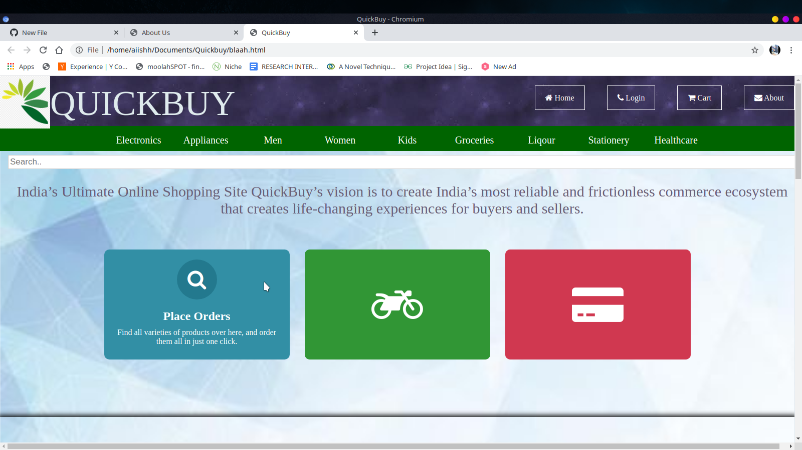
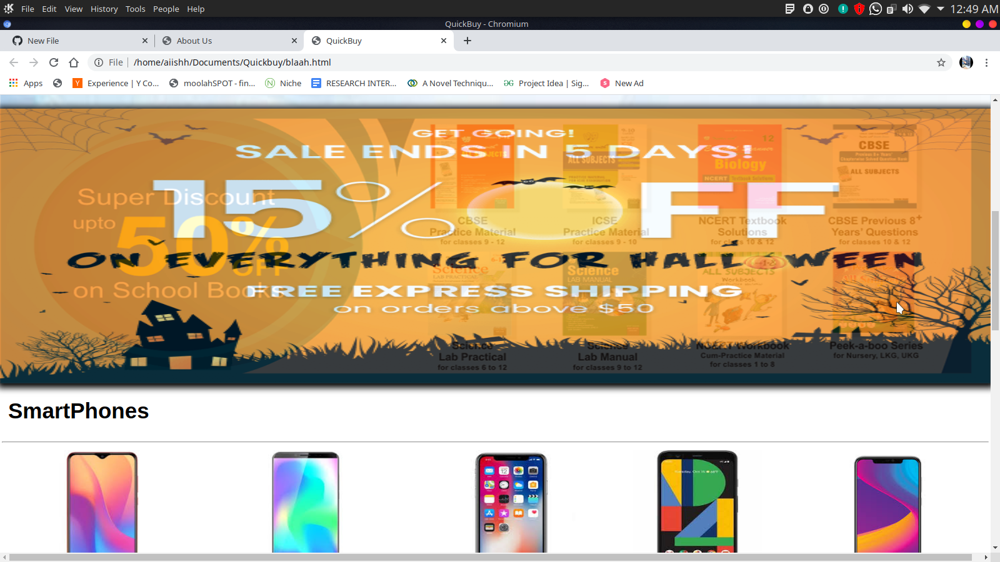
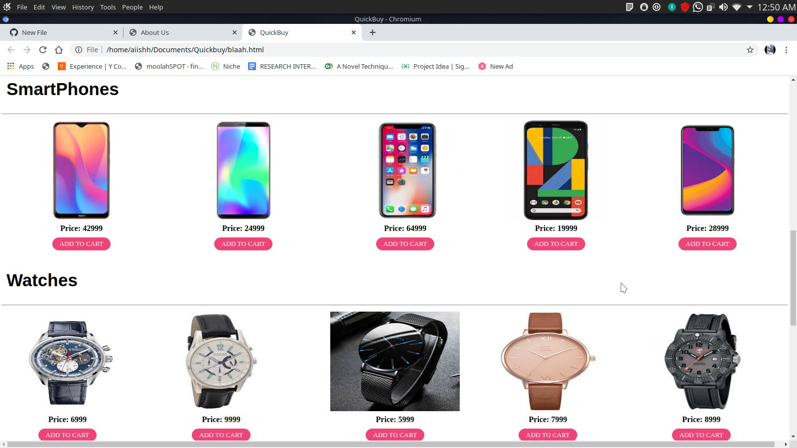
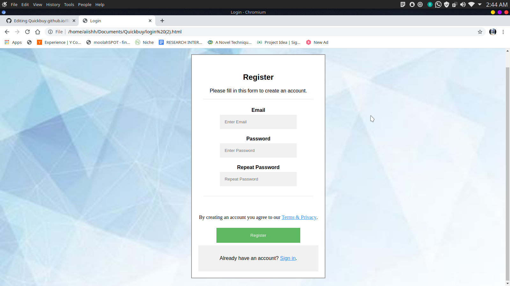
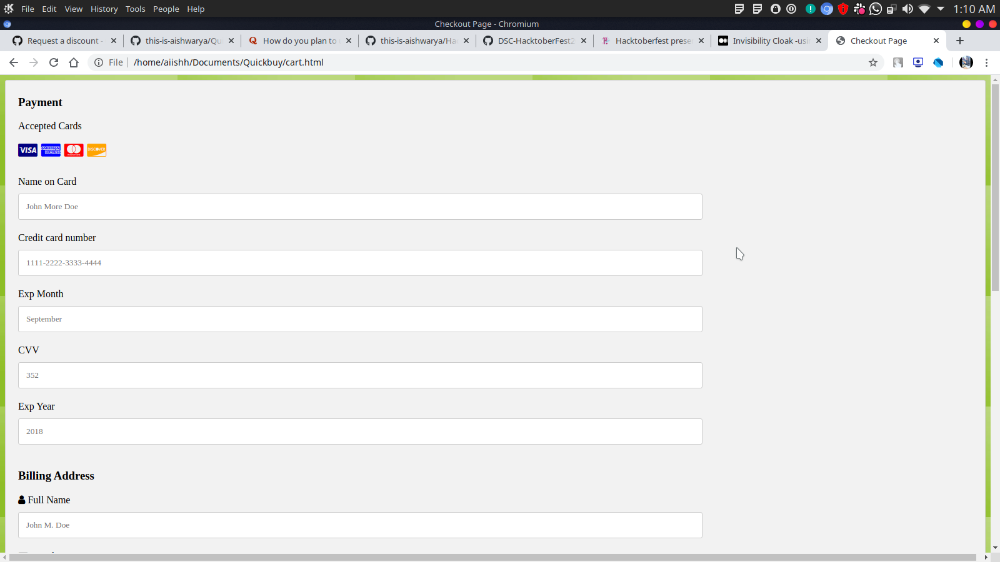

# Quickbuy - An online shopping site

With the advent of information technologies and emergence of online stores, online shopping has not been the same as it was in the past. Owing to the fast moving lifestyle, online shopping has been a growing phenomenon in all across the world. It has changed the way consumers shop for good & services. Consumers are using online shopping not just to buy goods and services, but also to browse online shops or to attain knowledge about potential purchases. Online shopping is the process whereby consumers directly buy goods and services from a seller interactively in real-time without an intermediary service over the internet. Consumers can visit online stores from the comfort of their homes and shop as they sit in front of the computer. With one click, customers can glance, the information regarding the product and services.

## Home Page

This is the overview of the homepage. The homepage consists of hover cards depicting the details of the site. A flashy banner displaying different schemes and offer. And a preview of all the items on sale.

## Login Page

## Cart Page

This is the final checkout page where user can fill in his details and payment options.
 
